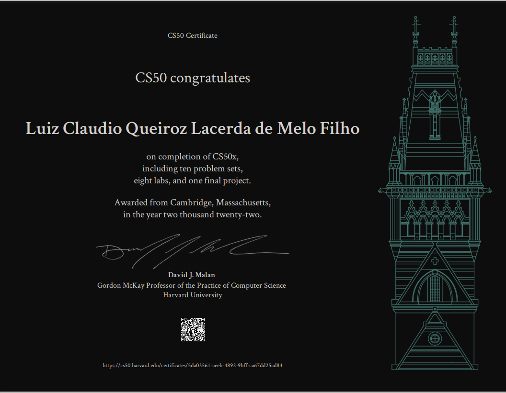

# CS50 2022 personal LABs and PROBLEMS SETS.

## [Check out my certification](https://certificates.cs50.io/5da03561-aeeb-4892-9bff-ca67dd25ad84.pdf):
  

## [Check out my finalproject](https://github.com/luizlacerdam/CS50/tree/main/finalproject) 

## This is CS50!
Introduction to Computer Science from Harvard, better known as CS50, is the largest course on the Harvard campus and more than 2,000,000 learners worldwide have registered for the course on edX. We are excited to offer a series of introductory CS50 courses and Professional Certificate programs from Harvard that are open to learners of all backgrounds looking to explore computer science, mobile app and game development, business technologies, and the art of programming.

This is CS50x , Harvard University's introduction to the intellectual enterprises of computer science and the art of programming for majors and non-majors alike, with or without prior programming experience. An entry-level course taught by David J. Malan, CS50x teaches students how to think algorithmically and solve problems efficiently. Topics include abstraction, algorithms, data structures, encapsulation, resource management, security, software engineering, and web development. Languages include C, Python, SQL, and JavaScript plus CSS and HTML. Problem sets inspired by real-world domains of biology, cryptography, finance, forensics, and gaming. The on-campus version of CS50x , CS50, is Harvard's largest course. 

Students who earn a satisfactory score on 9 problem sets (i.e., programming assignments) and a final project are eligible for a certificate. This is a self-paced course–you may take CS50x on your own schedule.
